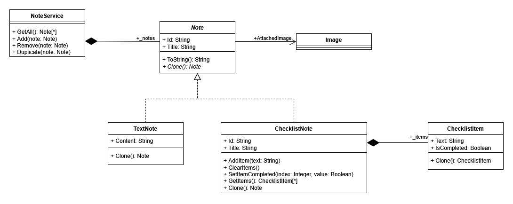

# ������������ ������ �1 � ������� �������� (Prototype)
## ���������� ������� � �������� ��������
� ������ ������� ����������� ���������� ��� ������� ������� ������ ���������. � ������ ���������� ������������ ������� ���� �����:
1. TextNote - ������� ��������� �������
2. ChecklistNote - ��������� ������� �� ������� ����� � ������������ �������� ��������
��� ������� ���� ����������� ��������� ���� �����������, � ����� ������� ������ ����� �������.

��������, ������������ ��� ����������, - ��� ���������� ����� ������� ���������� ��������� � ����� Duplicate ��� ���� if ����� � ����� �����������. ��-������, ��� �������� � ������������ - ������ ��� ����� ������ ���������� ���
��� ����������� ���������� ��������. �� ������ ����� ��������� ����� ���������, �� � ����������� ����������� ��� ����� ����������� ����. ��-������, ����� ������ �������� �������� ��� - ������������
� �����������. NoteService ������ ����� ���������� ���������� �������, � ��� ��������� ������������ �� ������� �������, � ������� if/else. � ����� �������� ����� �� ��������� ��������� �
������������ ������ Note �������� � ������������� �������������� ���� ����� Duplicate.

## 2. �������: ���������� �������� ��������
������� ��������� ������� ��������� ���������� � ���������� ������ � ��������� ����� Duplicate ��
```csharp
public void Duplicate(Note note)
{
    _notes.Add(note.Clone());
}
```
�������
```csharp
public void Duplicate(Note note)
{
    if (note is TextNote textNote)
    {
        var copy = new TextNote(
            textNote.Title + " (Copy)",
            textNote.Content
        );

        if (textNote.AttachedImage != null)
            copy.AttachedImage = new Bitmap(textNote.AttachedImage);

        _notes.Add(copy);
    }
    else if (note is ChecklistNote checklistNote)
    {
        var copy = new ChecklistNote(
            checklistNote.Title + " (Copy)"
        );

        foreach (var item in checklistNote.GetItems())
        {
            copy.AddItem(item.Text);
            copy.GetItems().Last().IsCompleted = item.IsCompleted;
        }

        if (checklistNote.AttachedImage != null)
            copy.AttachedImage = new Bitmap(checklistNote.AttachedImage);

        _notes.Add(copy);
    }
}
```

## 3. ��������� �������
��������� ������������ � ����� `klassi.drawio.png`.


## 4. �����
��������� �������� ���� ��������� ����������:
1. ������ ������������ - � ������ NoteService �� ����� ��������� ���������� ��� � ������������ ����������
2. ����������� �������� ���������� - ���������� ������� ���������� ������ Note � ����������� Clone() ��� ������������� ������ ����� NoteService