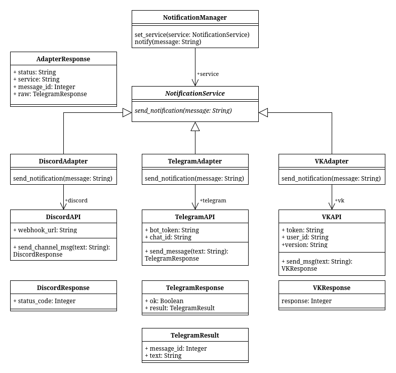

## Лабораторная работа №2 - Паттерн Адаптер
### Предметная область и описание проблемы

В данном проекте реализуется приложение для отправки сообщений в различные мессенджеры. Проблему которую должен решать паттерн - различные апи
предоставляют различный интерфейс для взаимодействия(разные параметры, разные форматы возвращаемых джисончиков). Без паттерна приложение должно знать структуру апи и специфичные возвращаемые результаты, использовать много if'ов; при добавлении сервиса придется писать новую ветку одного большого условия.

### Применение паттерна
Паттерн позволяет вынести всю бизнес логику из кода приложения
```python
def send(self):
    message = self.message_entry.get()
    service_name = self.service_var.get()
    self.manager.set_service(services[service_name])
    run_async(self.manager.notify(message))
    messagebox.showinfo("Sent", f"Message sent via {service_name}")
```
Взамен простыни
```python
        if service_name == "Telegram":
            
            ...

            api = TelegramAPI(bot_token, chat_id)
            run_async(self.send_telegram(api, message))

        elif service_name == "Discord":

            ...

            api = DiscordAPI(webhook)
            run_async(self.send_discord(api, message))

        elif service_name == "VK":
            
            ...

            api = VKAPI(token, peer_id)
            run_async(self.send_vk(api, message))
```

### Диаграмма классов



### Вывод
Внедрение паттерна дало следующие результаты
1. Убрано дублирование - исчезли повторяющиеся if ветки
2. Возможно простое расширение - бизнес логике вынесена в отдельный модуль, расширение не требует взаимодействия с приложением