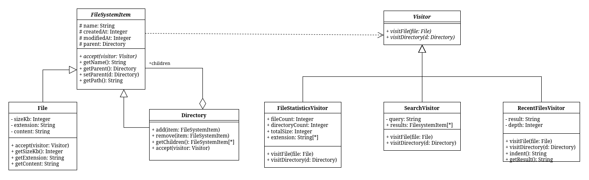

## Лабораторная работа №3 - Паттерн Visitor
### Предметная область и описание проблемы

В проекте реализован файловый менеджер с графическим интерфейсом.
Система содержит иерархию объектов: файлы и директории, над которыми выполняются различные операции — поиск, подсчёт статистики, вывод дерева.

Без использования паттерна вся логика операций размещается внутри классов File и Directory.
Это приводит к дублированию кода (везде одинаковый обход структуры), усложнению добавления новых операций.

### Применение паттерна

Паттерн Visitor позволяет вынести операции в отдельные классы и отделить их от структуры данных.

С использованием паттерна вызов операции выглядит так:

```c++
SearchVisitor visitor(query);
root->accept(visitor);
auto results = visitor.getResults();
```

Вся логика находится внутри Visitor, а классы File и Directory только принимают посетителя.

Без паттерна аналогичная логика выглядит так:

```c++
for (auto& child : children) {
    if (auto file = std::dynamic_pointer_cast<File>(child)) {
        if (file->matchesSearch(query)) {
            results.push_back(file->getFullName());
        }
    }
    else if (auto dir = std::dynamic_pointer_cast<Directory>(child)) {
        dir->search(query, results);
    }
}
```

Здесь приходится вручную проверять типы и дублировать обход структуры.

### Диаграмма классов



### Вывод

Внедрение паттерна дало следующие результаты

1. Исключено дублирование обхода структуры
2. Новые операции добавляются без изменения существующих классов
3. Логика отделена от модели данных, код теперь проще расширять