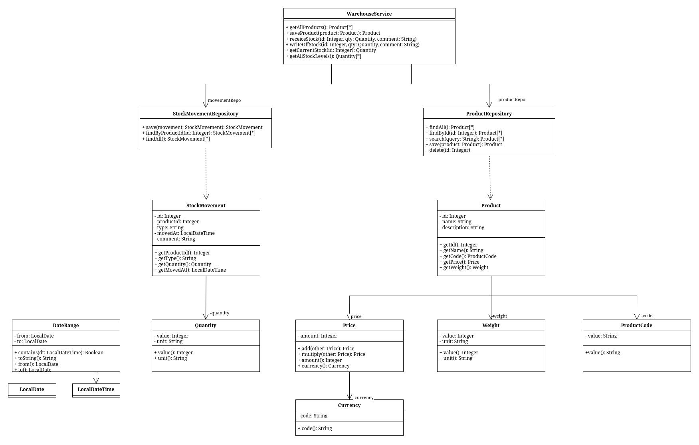

## Лабораторная работа №4 - Паттерн Value Object

### Предметная область и описание проблемы

В проекте реализована система управления складом с графическим интерфейсом.
Система работает с товарами, остатками и движениями склада, где каждый товар характеризуется кодом, ценой, весом и количеством.

Без использования паттерна все атрибуты передаются как примитивы (`String`, `BigDecimal`, `int`), а валидация дублируется в каждом методе сервиса.
Это приводит к расползанию логики проверок по всему коду и невозможности переиспользовать правила — например, формат кода товара проверяется отдельно в `addProduct` и снова в `updateProduct`.

### Применение паттерна

Паттерн Value Object инкапсулирует примитивное значение вместе с правилами его корректности в неизменяемый объект.

С использованием паттерна создание товара выглядит так:

```java
var product = new Product(
    null,
    name,
    new ProductCode(code),     // валидация формата ABC-1234 внутри
    new Price(amount, new Currency(currency)), // проверка отрицательности внутри
    new Weight(weightValue, weightUnit),
    description
);
productRepo.save(product);
```

Валидация срабатывает в конструкторе Value Object один раз, и некорректный объект просто не существует.

Без паттерна аналогичная логика выглядит так:

```java
public void addProduct(String name, String code,
                       BigDecimal price, String currency,
                       BigDecimal weightValue, String weightUnit) {

    if (code == null || !code.matches("[A-Z]{3}-\\d{4}"))
        throw new IllegalArgumentException("Неверный формат кода: " + code);

    if (price == null || price.compareTo(BigDecimal.ZERO) < 0)
        throw new IllegalArgumentException("Цена не может быть отрицательной");

    if (currency == null || !currency.matches("[A-Z]{3}"))
        throw new IllegalArgumentException("Неверный код валюты: " + currency);

    if (weightValue == null || weightValue.compareTo(BigDecimal.ZERO) <= 0)
        throw new IllegalArgumentException("Вес должен быть больше нуля");
    // ...
}
```

Те же проверки полностью повторяются в `updateProduct`, `receiveStock` и `writeOffStock`.

### Диаграмма классов



### Вывод

Внедрение паттерна дало следующие результаты

1. Логика валидации сосредоточена в одном месте — внутри Value Object, а не разбросана по сервисным методам
2. Дублирование проверок исключено: правило задаётся один раз и применяется везде автоматически
3. Код сервиса стал чище — методы работают с осмысленными типами вместо строк и чисел
